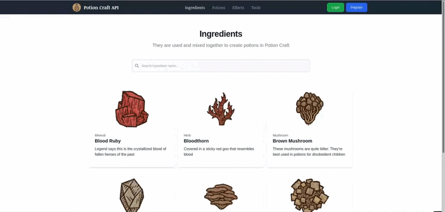

# Potion Craft API

Potion Craft API is a REST API inspired from the game [Potion Craft](https://www.potioncraft.com/).
All resources are rendered through React for an interactive experience.
A user can register or login but there's no additional features yet ! 
I planned to make any user able to create his own potions in the future.

---

 This project was created in order to show some of my skills like  :
* REST API creation and setup with API Platform
* Fetching datas with React-Query, Axios (post)
* Routing with React-Router
* JWT authentification via local storage
* Dynamic search bar and pagination
* PostgreSQL database setup
* Basic integration with TailwindCSS elements

## Get Started 

### Prerequisites

* PHP 8.1 or higher (Symfony 6.1)
* Composer
* Yarn / NodeJS

### Install

1. Clone this project
2. Install dependencies with `composer install` and `yarn install`
3. Create your `.env.local` and add your own database DSN
4. Create database, apply migrations, and fill it with fixtures : 
`bin/console doctrine:database:create`
`bin/console doctrine:migrations:migrate`
`bin/console doctrine:fixtures:load`

### Working

1. Run `yarn run dev --watch` to launch your local server for assets
2. Run `symfony serve` to launch your local php web server
3. **Done ! Check your localhost server :** `http://127.0.0.1:8000/`

## Built With

* Symfony 6.1
* API Platform 2.6
* React 18.2
* PostgreSQL
* TailwindCSS
